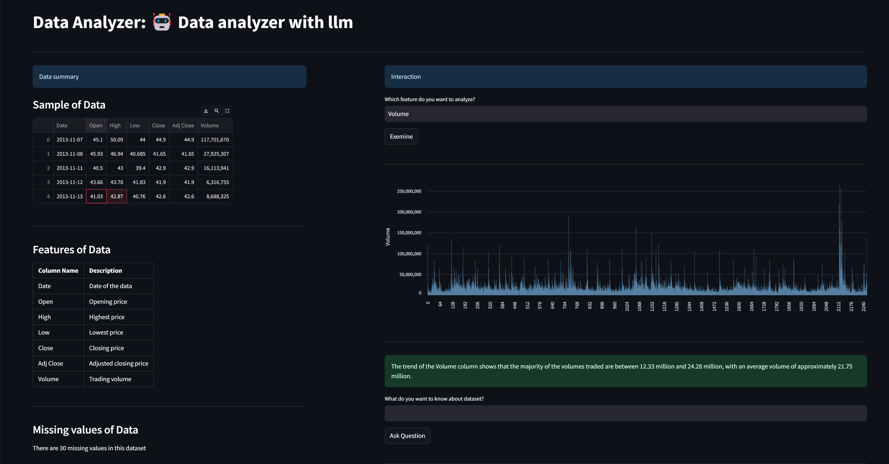
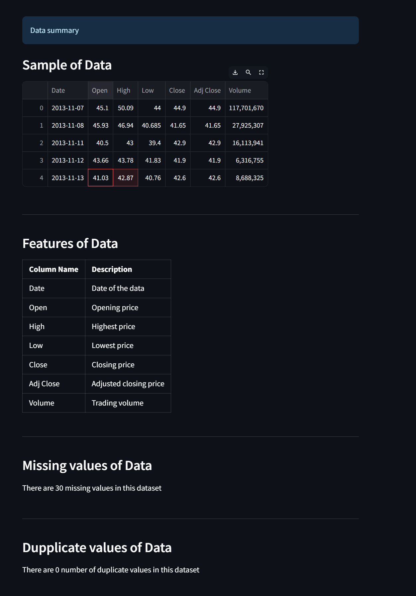
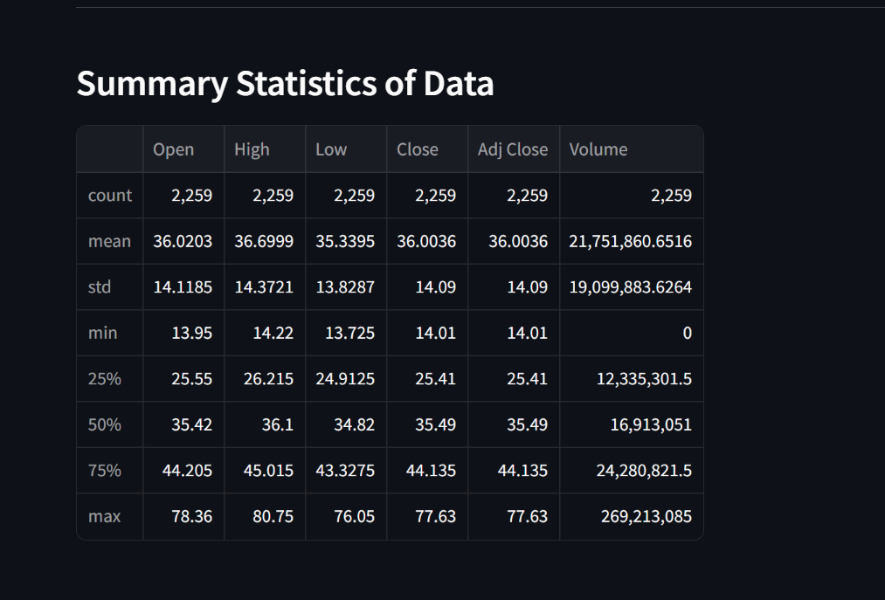
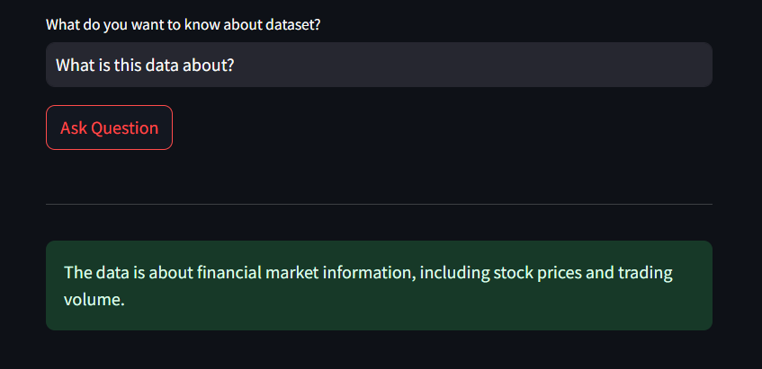
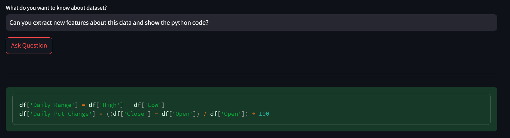

# Data Analyzer with LLM Agents

这是一个基于 Streamlit 和 LangChain 的数据分析应用，它可以：
- 自动分析 CSV 数据
- 生成数据摘要
- 回答关于数据的问题
- 分析数据趋势
- 支持多种文件编码（UTF-8、GBK、GB2312等）

## 功能特点

- 智能文件编码检测
- 自动识别日期列
- 数据可视化
- 自然语言交互
- 趋势分析

## 安装

1. 克隆仓库：
```bash
git clone [repository-url]
cd data-analyzer-app
```

2. 创建虚拟环境：
```bash
python3 -m venv .venv
source .venv/bin/activate  # Linux/Mac
# 或
.venv\Scripts\activate  # Windows
```

3. 安装依赖：
```bash
pip install -r requirements.txt
```

## 使用方法

1. 启动应用：
```bash
streamlit run app.py
```

2. 在浏览器中打开显示的URL（默认为 http://localhost:8501）

3. 上传CSV文件并开始分析

## 支持的文件格式

- CSV 文件
- 支持多种编码（UTF-8、GBK、GB2312、BIG5、UTF-16）
- 自动识别日期列

## 注意事项

- 确保CSV文件包含日期列（支持多种日期列名）
- 建议使用虚拟环境运行应用
- 首次运行可能需要下载语言模型


## Features

- **LLM Selection:** Choose from models like Gemini, Claude, or GPT to power your data analysis.
- **Descriptive Statistics:** Automatically generate descriptive statistics as soon as the dataset is uploaded.
- **Column Visualization:** Plot any selected column and get insights from the LLM based on the generated graph.
- **Ask Questions:** Ask any question about your dataset, and receive insightful answers from the selected LLM.

## Screenshots




 


## License

This project is licensed under the MIT License - see the [LICENSE](LICENSE) file for details.

## Contact

For any questions or feedback, please contact [kanitvural@gmail.com](mailto:kanitvural@gmail.com).


