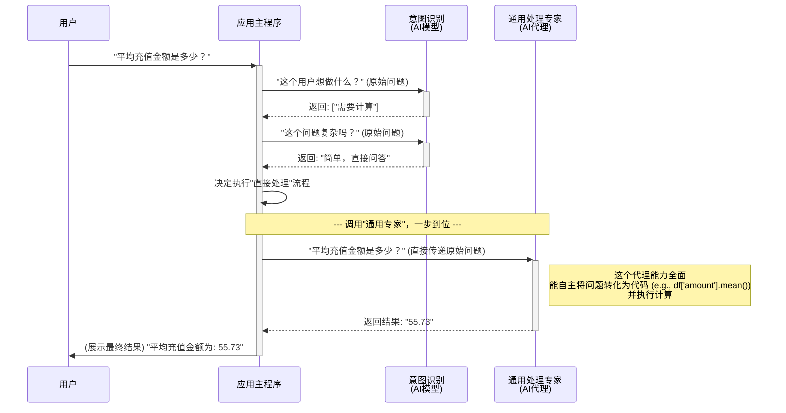
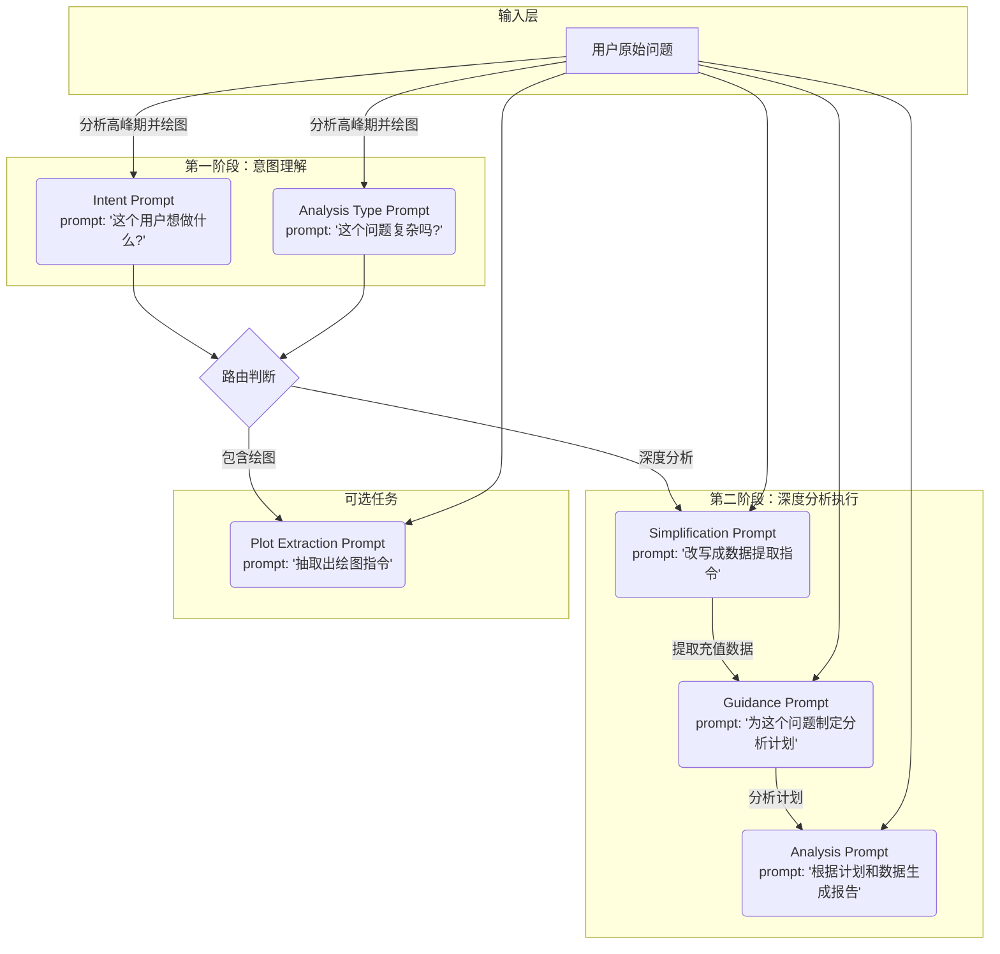
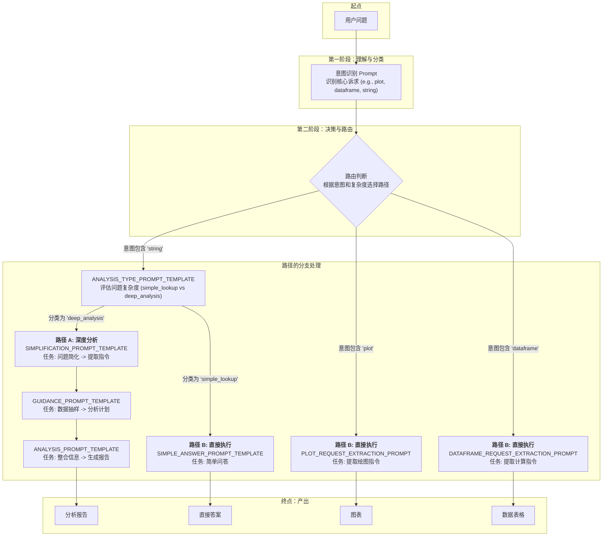

# LLM 智能数据分析助手 - 技术文档

本文档详细介绍了 LLM 智能数据分析助手的设计与实现，旨在为开发者提供全面的技术参考。

## 1. 项目概述

LLM 智能数据分析助手是一个基于大型语言模型（LLM）的交互式数据分析工具。用户可以上传自己的 CSV 数据集，并通过自然语言对话的方式，对数据进行探索、分析、计算和可视化。项目旨在降低数据分析的门槛，让不具备编程或复杂数据科学技能的用户也能快速从数据中获得洞见。

### 1.1. 核心功能

- **自然语言交互**: 用户通过聊天界面输入问题，系统能理解其意图。
- **智能意图识别**: 自动识别用户的请求类型，如深度分析、简单查询、数据计算、图表绘制等。
- **多代理路由**: 根据用户意图，将任务分发给专门的 AI 代理（Agent）进行处理。
- **动态分析生成**: 对于复杂问题，系统能够自主规划分析步骤，并生成详细的分析报告。
- **数据可视化**: 根据用户需求，自动生成图表并展示。
- **可扩展性**: 系统设计灵活，易于集成新的 LLM 模型、数据源或分析功能。

## 2. 系统架构

本系统采用模块化的分层架构，确保各组件的高内聚和低耦合。核心架构如下图所示：

```mermaid
graph TD
    subgraph "用户界面 (UI)"
        A[Streamlit Web App]
    end

    subgraph "核心业务逻辑"
        B[主控应用 app.py]
        C[意图识别模块<br/>intent_detector.py]
        D[数据处理模块<br/>data_processing.py]
        E[代理处理器<br/>agent_handler.py]
    end

    subgraph "AI 能力层"
        F[LLM 配置<br/>llm_config.py]
        G[提示工程<br/>prompts.py]
        H[PandasAI 代理<br/>(Extraction & Processing)]
        I[大型语言模型<br/>(e.g., DeepSeek, GPT)]
    end

    subgraph "数据层"
        J[用户上传的 CSV 文件]
        K[生成的图表/数据]
    end

    A -- 用户输入 --> B
    B -- 请求 --> C
    C -- 意图 --> B
    B -- 根据意图路由 --> E
    B -- 数据加载 --> D
    D -- DataFrame --> B
    E -- 创建/调用代理 --> H
    H -- 使用 LLM 和 Prompt --> I
    H -- 使用 Prompt --> G
    H -- 访问数据 --> J
    I -- 需要 LLM 配置 --> F
    H -- 生成结果 --> E
    E -- 响应 --> B
    B -- 更新 UI --> A
    E -- 生成的图表/数据 --> K
```

### 2.1. 架构解读与设计优势

这种分层、模块化的架构是经过深思熟虑的选择，其核心优势在于**清晰、可维护和高扩展性**。

1.  **用户界面 (UI) - `Streamlit`**:
    *   **为什么这么做？** 将 UI 逻辑完全封装在 `ui.py` 中，并由 `Streamlit` 驱动。
    *   **优势**: `Streamlit` 让开发者能用纯 Python 快速构建数据应用，极大地提升了开发效率。将所有 UI 代码（如 `st.write`, `st.chat_message`）集中管理，使得主应用 `app.py` 无需关心展示细节，只专注于业务流程，实现了前后端逻辑的初步分离。

2.  **核心业务逻辑 - `app.py` 与其它模块**:
    *   **为什么这么做？** 这是系统的"指挥中心"。它自身不执行具体任务（如调用 LLM、操作 DataFrame），而是像一个项目经理，负责理解任务（意图识别）、拆解任务（路由）并分发给合适的专家（代理处理器、数据处理器）。
    *   **优势**:
        *   **高内聚，低耦合**: 每个模块职责单一。例如，`prompts.py` 只管"话术"，`agent_handler.py` 只管"AI代理"，`intent_detector.py` 只管"意图识别"。当我们需要优化意图识别的准确率时，只需要修改 `intent_detector.py` 和相关的 `prompts.py`，而不会影响到数据处理或UI代码。
        *   **可维护性强**: 清晰的结构使得新开发者能快速理解代码逻辑，定位问题也更加容易。

3.  **AI 能力层 - `PandasAI`, `llm_config`, `prompts`**:
    *   **为什么这么做？** 将所有与 AI 相关的功能（模型、提示、代理）抽象成一个独立的"能力层"。
    *   **优势**: 这是实现**技术灵活性**的关键。我们可以轻易地替换底层的大语言模型（比如从 `DeepSeek` 换成 `GPT-4`），只需修改 `llm_config.py`；或者优化 AI 的分析逻辑，只需调整 `prompts.py` 中的提示。核心业务代码几乎不受影响，使得系统能快速适应 AI 技术的迭代。

4.  **数据层**:
    *   **为什么这么做？** 将数据源和产物明确分离。
    *   **优势**: 使得未来接入新的数据源（如数据库、API、其他文件格式）变得可能。只需修改 `data_processing.py` 来增加新的数据加载方式即可。

## 3. 核心组件详解

### 3.1. `app.py` - 主应用控制器

作为应用的大脑，`app.py` 的主要职责是：
1.  **初始化**: 设置页面、加载侧边栏、初始化会话状态。
2.  **接收输入**: 捕获用户上传的文件和输入的聊天问题。
3.  **调用意图识别**: 将用户问题发送给 `intent_detector` 模块。
4.  **逻辑路由 (Routing)**: 这是 `app.py` 的核心。根据返回的意图，它会决定执行哪个业务流程：
    *   **深度分析 (Deep Analysis) 流程**: 一个复杂的多步骤链条，包括问题简化、数据提取、动态分析指导生成、最终报告生成和可选的图表绘制。
    *   **直接处理 (Direct Processing) 流程**: 对于简单的查询、计算或绘图任务，直接调用相应的处理代理，按序完成任务。
5.  **调用代理**: 将任务分发给 `agent_handler` 创建的代理。
6.  **结果渲染**: 将代理返回的结果（文本、表格、图表）格式化后，通过 `ui.py` 中的函数在前端展示。
7.  **异常处理**: 捕获和处理分析过程中可能出现的错误。

### 3.2. `intent_detector.py` - 意图识别器

此模块的目标是精确理解用户的"真实意图"。
- **`get_intents(question)`**: 使用 LLM 和一个专门的 Prompt，从用户问题中识别出一个或多个核心意图，例如 `plot`（绘图）、`dataframe`（数据计算/提取）、`string`（问答）。这是一个多标签分类任务。
- **`get_analysis_type(question)`**: 当 `get_intents` 识别到 `string` 意图后，此函数会进一步判断问题的复杂性，将其分类为 `deep_analysis`（需要深入分析的复杂问题）或 `simple_lookup`（可以直接回答的简单问题）。

这种两阶段的意图识别机制，使得系统能有效区分简单任务和复杂任务，从而选择最优的处理路径，避免了对简单问题进行"杀鸡用牛刀"式的过度分析。

### 3.3. `agent_handler.py` - AI 代理处理器

该模块是 `PandasAI` 功能的封装层。
- **`create_extraction_agent(df, llm)`**: 创建一个"数据提取代理"。这个代理被配置为只执行数据筛选和提取操作，不进行计算或汇总。它在"深度分析"流程中用于从原始数据中精确分离出与用户问题最相关的子集。
- **`create_processing_agent(df, llm)`**: 创建一个"数据处理代理"。这是一个功能更全面的代理，能够执行数据计算、转换、聚合以及生成图表等多种任务。
- **`chat_with_agent(agent, question)`**: 执行与代理的交互，并返回结果。

通过分离不同职责的代理，系统可以更稳定、可控地执行多步骤任务。

### 3.4. `prompts.py` - 提示工程中心

这是系统的"灵魂"所在，集中管理了所有与 LLM 沟通的"话术"（Prompts）。将 Prompts 与业务逻辑代码分离，带来了诸多好处：
- **易于维护**: 可以独立地调整和优化 Prompts，而无需修改代码。
- **可复用性**: 多个地方可以共用同一个 Prompt 模板。
- **版本控制**: 可以像代码一样对 Prompts 进行版本管理。
- **清晰性**: 使得业务逻辑代码更聚焦于流程控制，而不是被大量的文本字符串淹没。

关键 Prompts 包括：
- `ANALYSIS_PROMPT_TEMPLATE`: 用于生成最终深度分析报告。
- `GUIDANCE_PROMPT_TEMPLATE`: 用于生成动态分析指导。
- `PLOT_REQUEST_EXTRACTION_PROMPT_TEMPLATE`: 从用户问题中提取专门用于绘图的指令。
- 等等...

### 3.5. `ui.py` 和 `data_processing.py`

- `ui.py`: 封装了所有与 Streamlit UI 相关的操作，如页面设置、侧边栏渲染、聊天消息展示等，使主逻辑更干净。
- `data_processing.py`: 负责文件加载和一些通用的预处理步骤，实现了数据接入与核心分析逻辑的解耦。

## 4. 核心工作流程：双轨制设计的智慧

系统的工作流程经过精心设计，形成了"深度分析"和"直接处理"并行的双轨制。这种设计的核心思想是**在分析的深度、准确性与响应速度、资源消耗之间找到最佳平衡点**。

-   **为什么需要区分两种流程？**
    1.  **用户意图的复杂性不同**: 一个"帮我分析用户流失原因"的问题和一个"计算平均客单价"的问题，其复杂度天差地别。如果用同一套流程处理，要么对简单问题"杀鸡用牛刀"，造成不必要的延迟和成本；要么对复杂问题"隔靴搔痒"，无法给出有深度的洞见。
    2.  **资源效率**: "深度分析"流程涉及到多次 LLM 调用，是一个资源密集型任务。将其限定在真正需要复杂分析的场景，可以显著节约计算资源和 API 调用成本。
    3.  **用户体验**: 对于简单直接的问题，用户期望快速得到答案。"直接处理"流程绕过了所有不必要的中间步骤，能提供更即时的响应。

因此，通过 `intent_detector.py` 的前置判断，系统能够像一个经验丰富的数据分析师一样，对问题进行快速分类，然后选择最高效的路径来解决问题。

### 4.1. 流程1：深度分析 (Deep Analysis) - 追求质量与深度

```mermaid
sequenceDiagram
    participant U as 用户
    participant App as 应用主程序
    participant IntentLLM as 意图识别<br>(AI模型)
    participant TaskLLM as 任务处理<br>(AI模型)
    participant Extractor as 数据提取专家<br>(AI代理)
    participant Plotter as 图表绘制专家<br>(AI代理)

    U->>+App: "分析一下我们用户的充值高峰期在什么时间段，并画出图表"
    App->>+IntentLLM: "这个用户想做什么？" (原始问题)
    Note right of IntentLLM: 第一轮判断：识别核心诉求
    IntentLLM-->>-App: 返回: ["需要分析", "需要画图"]
    
    App->>+IntentLLM: "这个问题复杂吗？" (原始问题)
    Note right of IntentLLM: 第二轮判断：评估问题难度
    IntentLLM-->>-App: 返回: "复杂，需要深度分析"
    
    App->>App: 决定执行"深度分析"流程
    
    Note over App, TaskLLM: --- 第1步: 简化问题，明确提取目标 ---
    App->>+TaskLLM: "请把这个问题'分析一下...图表'，改写成一个只用于提取数据的指令"
    TaskLLM-->>-App: 返回: "提取与用户充值时间和金额相关的数据"
    
    Note over App, Extractor: --- 第2步: 调用"提取专家"，获取最相关的数据子集 ---
    App->>+Extractor: "使用这个指令'提取...的数据'，处理原始表格"
    Note right of Extractor: 这个代理只做筛选，不做计算<br>保证了数据的原始性和准确性
    Extractor-->>-App: 返回: 一个只包含相关充值记录的新表格
    App->>U: (展示中间结果) "为了回答您的问题，我提取了这些数据：" (展示新表格)

    Note over App, TaskLLM: --- 第3步: 生成分析计划，模拟专家思路 ---
    App->>+TaskLLM: "对于问题'分析...高峰期'，和这些数据样本，请给出一个分析步骤"
    Note right of TaskLLM: 这是"授人以渔"的关键<br>让AI先思考如何做，再动手
    TaskLLM-->>-App: 返回分析计划: "1. 按小时对数据分组; 2. 统计每小时的充值总额; 3. 找到金额最高的时段"
    
    Note over App, TaskLLM: --- 第4步: 整合信息，生成最终分析报告 ---
    App->>+TaskLLM: "请根据'原始问题'，'分析计划'和'提取的完整数据'，生成一份详细报告"
    TaskLLM-->>-App: 返回最终分析报告 (Markdown格式的长文本)
    App->>U: (展示最终结果) "根据分析，您的用户充值高峰期在..."

    Note over App, Plotter: --- 第5步: 检测到绘图需求，执行绘图任务 ---
    App->>+Plotter: "请根据之前提取的数据，画出每小时充值总额的条形图"
    Note right of Plotter: 使用第2步提取的数据，避免重复劳动
    Plotter-->>-App: 返回图表图片
    App->>-U: (展示最终结果) (显示图表)

```

该流程专为处理模糊、开放性的复杂分析问题而设计。它的每一步都有明确的目的，构成一个逻辑严密的分析链条，模拟了人类专家的思考过程：
1.  **简化问题**: 聚焦核心，排除干扰信息。
2.  **提取相关数据**: 缩小分析范围，提高后续步骤的准确性和效率。
3.  **生成分析指导**: 这是整个流程的"神来之笔"。系统不是直接给出答案，而是先"思考"如何分析，形成一个动态的、针对具体问题的分析框架。这使得最终的报告更有条理、更有逻辑。
4.  **生成报告/图表**: 基于上述所有上下文，执行最终的分析和可视化。

**核心优势**: 能够处理高度复杂的分析任务，提供具有深刻洞察力的、结构化的分析报告，而不仅仅是单一的数值或图表。

### 4.2. 流程2：直接处理 (Simple Lookup / Plot / DataFrame) - 追求速度与效率



这个流程是"短、平、快"的代名词，适用于意图明确、操作具体的请求（如"XX的总和是多少？""画出XX的饼图"）。

**核心优势**: 响应速度快，资源消耗低。通过绕过所有复杂的分析步骤，直接将任务交给 `PandasAI` 的处理代理，为用户提供了即时、高效的交互体验。

## 5. 工具与技术栈

- **后端框架**: [Streamlit](https://streamlit.io/) - 用于快速构建交互式 Web 应用。
- **AI 核心库**: [PandasAI](https://github.com/gventuri/pandas-ai) - 作为连接语言模型和 Pandas 数据操作的桥梁。
- **核心语言**: Python 3.9+
- **数据处理**: Pandas
- **图表绘制**: Matplotlib (由 PandasAI 在后端调用)
- **依赖管理**: `requirements.txt`
- **LLM 支持**: 可通过 `llm_config.py` 配置，支持 `langchain_community.chat_models` 中的多种模型，如 DeepSeek, OpenAI GPT 系列等。

## 6. 项目构建与部署

### 6.1. 本地运行
1.  **克隆代码库**: `git clone <repository_url>`
2.  **创建虚拟环境**: `python -m venv venv`
3.  **激活环境**: `source venv/bin/activate` (macOS/Linux) 或 `venv\Scripts\activate` (Windows)
4.  **安装依赖**: `pip install -r requirements.txt`
5.  **配置环境变量**: 创建一个 `.env` 文件，并设置所需的 API Keys (例如 `DEEPSEEK_API_KEY`)。
6.  **启动应用**: `streamlit run app.py`

### 6.2. Docker 部署
项目提供了 `Dockerfile`，可以方便地进行容器化部署。
```bash
# 1. 构建 Docker 镜像
docker build -t llm-data-analyzer .

# 2. 运行容器
# (需要通过 -e 传入环境变量)
docker run -p 8501:8501 -e DEEPSEEK_API_KEY="YOUR_API_KEY" llm-data-analyzer
```
### 6.3. Railway.app 一键部署
项目包含 `railway.toml` 配置文件，可以直接链接到 [Railway.app](https://railway.app/) 平台进行一键部署。Railway 会自动检测 `requirements.txt` 和 `Procfile` (由 `railway.toml` 定义)，并完成构建和部署。只需在 Railway 的环境变量设置中填入所需的 API Keys 即可。

## 7. 技术灵活性与前瞻性

本项目在设计上充分考虑了未来的扩展和变化。

- **模型无关性**: 通过 `llm_config.py` 将模型配置抽象出来。更换或增加新的 LLM (如 Anthropic Claude, Google Gemini) 只需在该文件中进行少量修改，而无需触动核心业务逻辑。
- **Prompt 集中管理**: `prompts.py` 的设计使得对 AI 行为的微调变得简单高效。未来可以引入 Prompt 版本控制、AB 测试等高级功能。
- **可插拔的代理**: `agent_handler.py` 的设计模式允许轻松添加新型代理。例如，可以增加一个专门用于生成 SQL 查询的 `SQLAgent`，或一个用于调用外部 API 的 `ToolAgent`。
- **意图扩展**: `intent_detector.py` 可以方便地扩展，以识别更多用户意图（如"保存分析结果"、"发送邮件报告"等），并在主控流程中增加相应的处理逻辑。
- **云原生部署**: 借助 `Dockerfile` 和 `railway.toml`，项目天然具备良好的云原生特性，易于在各种现代云平台上进行弹性伸缩和持续集成/持续部署 (CI/CD)。

通过上述设计，本项目不仅满足了当前的需求，也为未来功能的迭代和技术栈的演进奠定了坚实的基础。

## 8. 提示工程 (Prompt Engineering): AI 的"指挥脚本"

提示（Prompt）是与大型语言模型（LLM）沟通的指令，它决定了 AI 的行为、回应质量和任务执行的准确性。在这个项目中，我们没有使用单个庞大而复杂的 Prompt，而是设计了一系列小而精、职责单一的 Prompts，并将它们组合在工作流中，形成"提示链"（Prompt Chain）。

### 8.1. Prompt 在系统中的位置

下图展示了在一次典型的"深度分析"流程中，各个核心 Prompt 是如何被依次调用，并协同工作的。



### 8.2. 核心 Prompt 详解

以下是本系统中使用的核心 Prompt 的详细说明。

---
#### 1. `INTENT_DETECTION_PROMPT_TEMPLATE`

-   **核心作用**: 判断用户的核心诉求，是所有流程的起点。它将用户的自然语言问题分类为一个或多个标准意图（`plot`, `dataframe`, `string`）。
-   **设计价值**: 实现任务的初步分流。系统通过这一步知道接下来可能需要调用计算、绘图还是问答能力，避免了盲目执行，是实现路由分发的"第一道关卡"。
-   **模板内容**:
    ```python
    """You are an intent recognition assistant. Please determine the user's intent based on their question, there can be multiple intents (separated by English commas, in the order of plot, dataframe, string).

The intent definitions are as follows:
- plot: The user wants to generate a chart (e.g., bar chart, line chart, pie chart)
- dataframe: The user wants to get a table, column, or detailed data
- string: The user wants to get a text summary, explanation, or brief analysis

Please determine the intent of the following question, no explanation needed, just output the intent keywords:
Question: {query}
"""
    ```

---
#### 2. `ANALYSIS_TYPE_PROMPT_TEMPLATE`

-   **核心作用**: 当识别到问答（`string`）意图后，此 Prompt 对问题进行二次分类，判断其是 `simple_lookup` (简单查询) 还是 `deep_analysis` (深度分析)。
-   **设计价值**: 这是实现"双轨制"工作流的关键。通过这一步，系统能区分"XX是多少？"这类简单问题和"XX为什么会这样？"这类复杂问题，从而决定是启动完整的多步分析流程，还是直接快速回答，极大地优化了资源利用和响应速度。
-   **模板内容**:
    ```python
    """You are an expert at classifying user questions about data. Classify the user's question into one of two categories: 'simple_lookup' or 'deep_analysis'.

- 'simple_lookup': The user is asking for a specific data point, a simple calculation, or a direct retrieval. Examples: "What was the total revenue on May 1st?", "Which day had the highest income?", "List all transactions for user X."
- 'deep_analysis': The user is asking for reasons, causes, comparisons, trends, or a comprehensive explanation. Examples: "Why did revenue drop in June compared to May?", "Analyze the sales trend for the last quarter.", "What are the key factors influencing user churn?"

Based on the definition, classify the following question. Respond with only 'simple_lookup' or 'deep_analysis'.

**User's Original Question:**
"{question}"

**Your Output:**
"""
    ```

---
#### 3. `SIMPLIFICATION_PROMPT_TEMPLATE`

-   **核心作用**: 在"深度分析"路径中，将用户可能很口语化、很复杂的长问题，改写成一个清晰、明确的"数据提取指令"。
-   **设计价值**: **聚焦**和**降噪**。它强迫 AI 思考回答这个问题的核心是要看哪些数据，并去除原始问题中的分析性描述，只保留对数据的"提取"要求。这使得后续交给 `PandasAI` 代理执行时，任务更单一，成功率更高。
-   **模板内容**:
    ```python
    """You are an expert at simplifying complex data analysis questions into a clear data extraction query for a later analysis step..."""
    ```

---
#### 4. `GUIDANCE_PROMPT_TEMPLATE`

-   **核心作用**: 让 LLM "扮演"一个资深数据分析师，根据用户的问题和一小部分数据样本，来制定一个宏观的"分析计划"或"指导方针"。
-   **设计价值**: 这是提升最终分析报告质量的"神来之笔"。它让 AI 从"直接给答案"的模式，转变为"先思考如何分析，再执行分析"的模式。这份指导确保了后续最终报告的逻辑性、条理性和深度。
-   **模板内容**:
    ```python
    """You are a data analysis planner. Based on the user's question and a data sample, your task is to generate a concise, one-paragraph set of instructions..."""
    ```

---
#### 5. `ANALYSIS_PROMPT_TEMPLATE`

-   **核心作用**: 这是生成最终深度分析报告的"总装车间"。它向 LLM 提供了最全的上下文信息。
-   **设计价值**: 通过提供充足且结构化的信息（用户问题 + 分析计划 + 完整相关数据），该 Prompt 能够引导 LLM 生成一份结构清晰、有理有据、格式精良的 Markdown 分析报告，而不仅仅是一个简单的回答。
-   **模板内容**:
    ```python
    """You are a world-class data analyst. I will provide you with data in CSV format, a user's question, and specific analysis guidance..."""
    ```

---
#### 6. `PLOT_REQUEST_EXTRACTION_PROMPT_TEMPLATE`

-   **核心作用**: 当用户的请求中既包含分析又包含绘图时（如"分析原因并画图"），这个 Prompt 会像一个"过滤器"，只把其中关于"画图"的指令精确地提取出来。
-   **设计价值**: **任务解耦**。分析任务和绘图任务可以被分开处理，甚至可以交给不同的专门代理，提高了流程的健壮性和灵活性。
-   **模板内容**:
    ```python
    """From the user's query below, extract only the specific instruction for creating a plot..."""
    ```

---
#### 7. `DATAFRAME_REQUEST_EXTRACTION_PROMPT_TEMPLATE`

-   **核心作用**: 与绘图提取类似，它只从用户问题中提取和数据计算、表格生成相关的指令。
-   **设计价值**: 保证了在"直接处理"流程中，交给 `PandasAI` 的指令是纯粹的数据计算请求，提高了数据处理代理的执行效率和准确性。
-   **模板内容**:
    ```python
    """From the user's query below, extract only the specific instruction for creating or calculating a table of data..."""
    ```

---
#### 8. `SIMPLE_ANSWER_PROMPT_TEMPLATE`

-   **核心作用**: 在"简单查询"路径中，用于生成直接、简洁的答案。
-   **设计价值**: **效率**。对于简单的查询，用户期望快速得到答案。此 Prompt 避免了生成冗长的报告，直接根据数据给出答案，提供了更好的用户体验。
-   **模板内容**:
    ```python
    """You are a helpful data assistant. Based on the user's question and the provided data, give a direct and concise answer..."""
    ```

### 8.3. Prompt 逻辑关系图




项目prompt